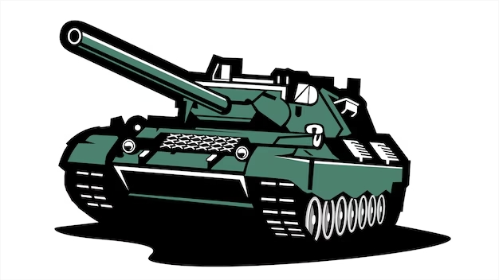

# 🎮 Party Game: Tanques

**Party Game: Tanques** es un proyecto desarrollado con el apoyo de herramientas de inteligencia artificial, creado con el objetivo de acompañar y potenciar mi aprendizaje en el uso del motor gráfico **Godot Engine**.

El juego se encuentra en constante evolución: a medida que adquiera nuevos conocimientos y habilidades en desarrollo, se irán incorporando mejoras tanto en la jugabilidad como en el apartado visual y técnico.

Este proyecto también tiene como meta su posible presentación en la **Expotécnica 2026**, no solo como un producto final, sino como una muestra del proceso de aprendizaje, experimentación y crecimiento a lo largo de su desarrollo.
